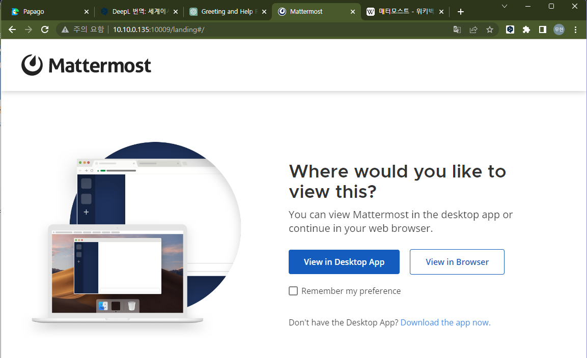

# [Mattermost](https://mattermost.com/)
파일 공유, 검색, 통합 기능을 제공하는 오픈소스 셀프호스팅 채팅 서비스 </br>
자체 호스팅을 통해 데이터 및 파일을 회사 내부에서 보관할 수 있다.</br>

설치 버전 : 7.7.1 </br>
설치 환경 : Windows 11, VirtualBox 7.0, Ubuntu 22.04.1 </br>
필요 프로그램 : MySql Server or MariaDB </br>
[Mattermost Github](https://github.com/mattermost/docker) </br>

## 설치 방법
[공식 가이드](https://docs.mattermost.com/guides/deployment.html#install-guides)
1. 도커를 이용한 설치
    * 곧바로 사용 가능하다.
    * 배포된 다양한 버전의 도커이미지가 존재한다.
    >docker run --name mattermost-preview -d --publish 8065:8065 --add-host dockerhost:127.0.0.1 mattermost/mattermost-preview 

2. Git을 이용한 방식
    * [참조](https://judo0179.tistory.com/59)  
3. tar.gz 파일을 이용한 직접 설치
    * [참조](https://sakwon.tistory.com/73)

## 설치 순서
1. DB 설치 (MySql 또는 MariaDB)
2. DB 환경구성 (테이블 생성, 계정생성, 권한부여)
3. Mattermost 다운로드  파일 구성
4. 설정파일 변경
5. 서비스 설정
6. 서비스 실행

### 서비스 구동 명령
    systemctl start mysql
    systemctl start mattermost.service

### 서비스 자동 실행 명령
    systemctl enable mysql
    systemctl enable mattermost.service

### 시스템 테스트 명령
    cd /opt/mattermost
    sudo -u mattermost ./bin/mattermost
    sudo systemctl status mattermost.service 
    curl http://localhost:8065


## 결과 화면



## etc
### NAT		(Network Address Translation)
    IP패킷에 있는 출발지 및 목적지의 IP주소와 포트를 바꿔 재기록하여 트래픽을 주고받게 하는 기술
### 포트포워딩	(Port Forwarding)
    패킷이 네트워크 게이트를 지날 때 IP주소와 포트번호 결합의 통신 요청을 다른곳으로 넘겨주는 주소 변환 방법
    외부IP:port -> 내부IP:port 로 매핑
### DNAT		(Destination NAT)
	도착지 주소를 변경하는 NAT
### SNAT		(Source NAT)
	출발지 주소를 변경하는 NAT
``` bash
# SNAT rule
sudo iptables -t nat -A POSTROUTING -p tcp -s 172.17.0.2 --sport 8065 -d 192.168.56.1 -j SNAT --to-source 192.168.56.1

# DNAT rule
sudo iptables -t nat -A PREROUTING -p tcp -d 192.168.56.1 --dport 8065 -j DNAT --to-destination 172.17.0.2:8065
```

## Docker
이미지	: 프로세스 실행 환경 </br>
컨테이너	: 프로세스

이미지명 구성 
>계정/레퍼지토리:태그

실행 명령(prefix)
>docker

### ps
    현재 실행중인 모든 컨테이너 목록 출력
    -a	중단된 컨테이너를 포함하여 출력

### run	
    컨테이너를 실행
    run -it [이미지]:[태그] [실행 프로그램]</br>
        i   : foreground 에서 실행
        d 	: background 에서 실행
        t	: 가상터미널 환경 애뮬레이션
        p [외부포트:내부포트] : 포트포워딩 실행
        --net [연결할 네트워크 명]

### images
    시스템에 저장된 이미지 확인
### stop [ID]
    컨테이너 중지
### restart [ID]
    컨테이너를  되살린다.
### attach [ID] 
    실행되고 있는 컨테이너를 터미널과 연결한다.
### pull [imgName]	
    저장소에서 이미지를 가져온다.
### push [이미지]:[태그]	
    이미지를 저장소에 push 한다.
### commit [ID] [이미지]:[태그]	
    도커 이미지 생성
### diff [ID]	
    컨테이너의 변경사항을 출력한다.
### rm [ID]
    컨테이너를 삭제한다.
### rmi [이미지]:[태그]	
    이미지를 삭제한다.
### build -t [이미지]:[태그] .	
    Dockerfile을 기반으로 이미지를 빌드한다.
### network disconnect [브릿지] [컨테이너]	
    네트워크 해제
### network connect [브릿지] [컨테이너]		
    네트워크 할당
### docker-compose 
    up		: 모든 서비스 컨테이너를 한번에 생성하고 실행
    down		: 모든 실행중인 컨테이너를 정지시키고 삭제
    ps		: 모든 서비스 컨테이너 목록 조회

