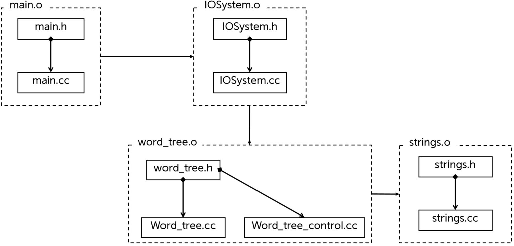

# Voca Note
Tree 자료형을 이용한 단어장 프로그램이다.</br>
이진트리로 구성되며, 왼쪽은 자식, 오른쪽은 동급으로 취급한다.</br>
각 노드에는 의미를 저장할 수 있으며 트리 탐색을 통해 의미 있는 값까지 도달하면 단어와 정의에 대한 정보를 얻을 수 있다.</br>
이를 이용하여 CRUD를 구현하고 편의기능을 제공하는 프로그램을 작성하였다.</br>

* 개발 언어 : C++
* 개발 환경 : Linux Ubunt 22.04.1
* IDE : Vim, make, VScode

# 파일구조 (UML)
* main.o
* IOSystem.o
* word_tree.o
* strings.o

네개의 주요 오브젝트 파일을 링킹하여 컴파일 함</br>
</br>

# 사용 라이브러리
* iostream
* string  
* cstring      
* algorithm            
* list      

# 헤더파일 구성
## [Main.h](./MarkDown/main.md)</br>
- 주요 함수를 순차적으로 실행시킴
- 환경 설정

## [word_tree.h](./MarkDown/word_tree.md)</br>
- 사용자 입력처리를 담당
- CLI환경에서 사용할 수 있는 도움말 등의 기능

## [IOSystem.h](./MarkDown/IOSystem.md)</br>
- 주요 함수들을 정의
- 데이터 가공 및 실행결과 출력
- word_tree.cc  : 출력을 담당하거나 사용자가 호출하게 되는 메소드 정의
- word_tree.control : 내부 데이터에 영향을 주거나 특정 알고리즘이 필요한 메소드 정의

## [strings.h](./MarkDown/strings.md)</br>
- 입출력 시 문제가 될 수 있는 입력 데이터를 필터링 하기위한 함수 정의
</br>

# Makefile 

```
OBJS = main.o word_tree.o word_tree_control.o IOSystem.o strings.o 

# ㅡㅡㅡㅡㅡㅡㅡㅡㅡㅡㅡㅡㅡㅡㅡㅡㅡㅡㅡㅡㅡㅡㅡㅡㅡㅡㅡㅡㅡㅡㅡㅡㅡ
word_tree : $(OBJS)
	g++ $(OBJS) -o word_tree

main.o : main.h main.cc word_tree.h IOSystem.h
	g++ -c main.cc

word_tree.o : word_tree.h word_tree.cc word_tree_control.o
	g++ -c word_tree.cc

word_tree_control.o : word_tree.h word_tree_control.cc strings.o
	g++ -c word_tree_control.cc

IOSystem.o : IOSystem.h IOSystem.cc
	g++ -c IOSystem.cc

strings.o : strings.h strings.cc
	g++ -c strings.cc

#ㅡㅡㅡㅡㅡㅡㅡㅡㅡㅡㅡㅡㅡㅡㅡㅡㅡㅡㅡㅡㅡㅡㅡㅡㅡㅡㅡㅡㅡㅡㅡㅡㅡ
.PHONY: clean all
clean : 
	rm -f $(OBJS)
```
# 구현 기능


# 문제점
1. 띄워쓰기 및 특수문자에 대한 처리 방안이 마련되어 있지 않다.
2. 설계상의 문제
   1. Find 함수의 비효율적인 알고리즘
   2. 단방향 링킹이 가져오는 탐색의 불편함
   3. 위의 문제로인한 불필요한 함수의 반복적인 호출
3. IOSystem 미흡
4. 제한적인 상황에서의 테스트


[표시내용](#tag123)


#### tag123


```cpp

```


</br>

{:width="50%" height="50%"}