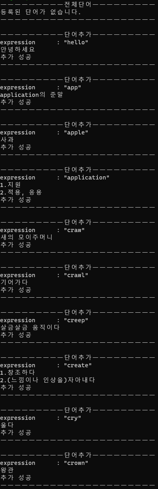
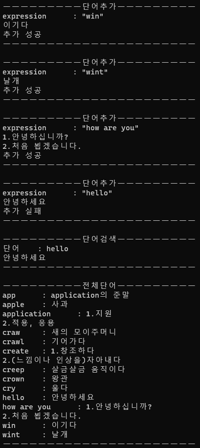
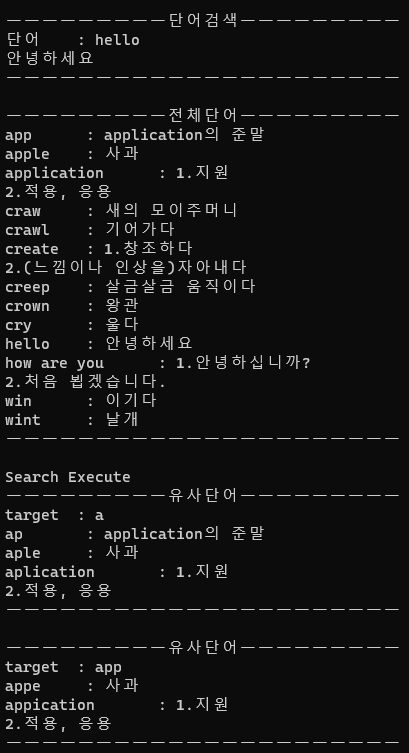
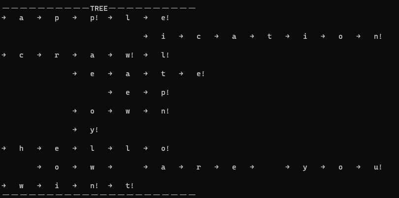
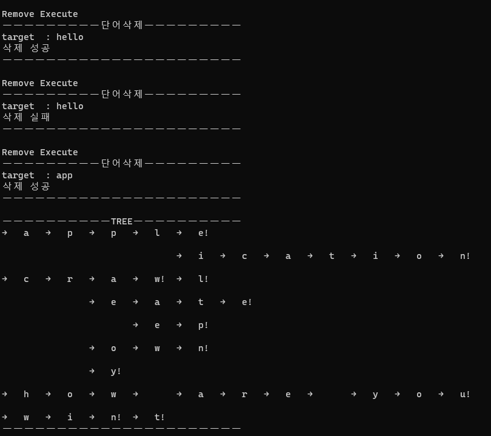
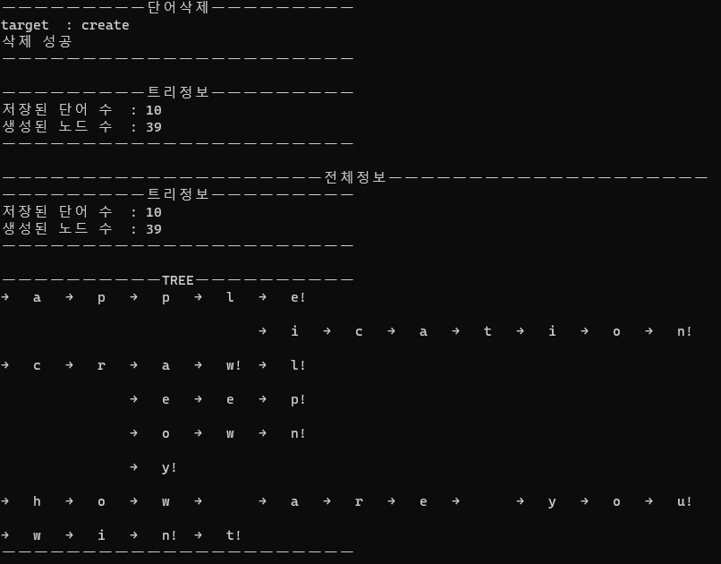
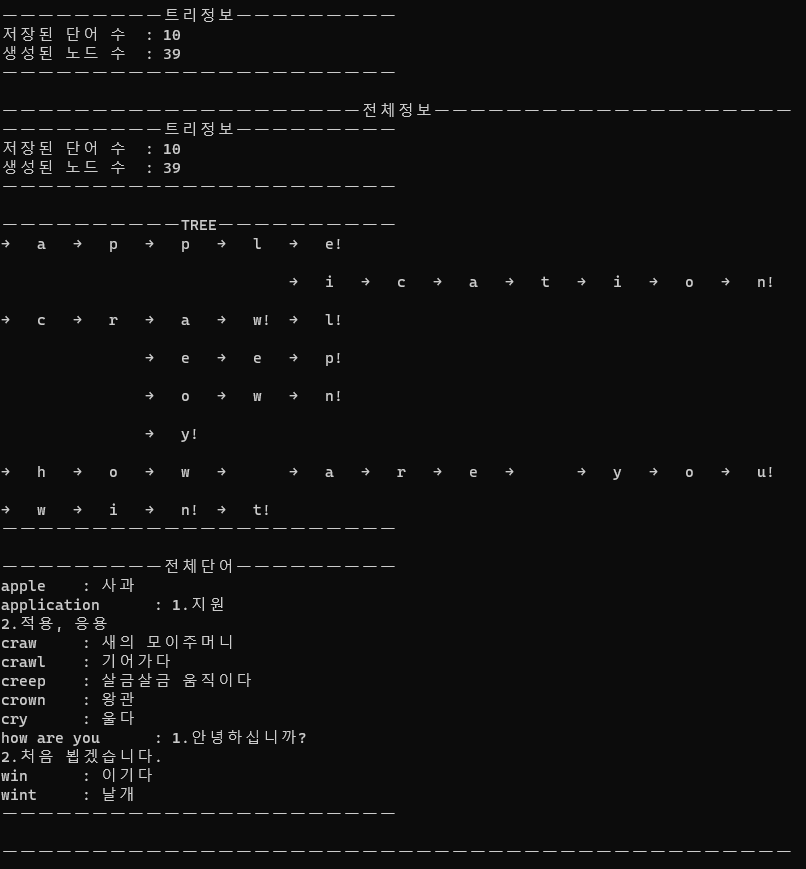
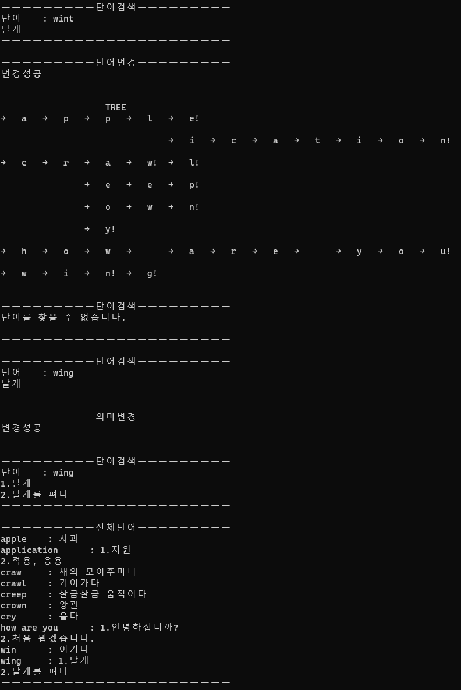
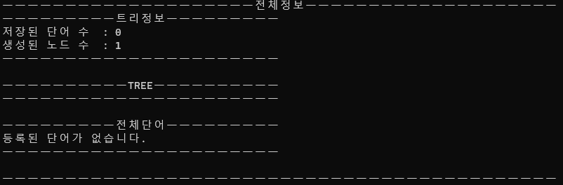

[뒤로가기](../Readme.md)

## 시현

``` cpp
void DictionaryExample(WordDictionary & wd)
{
    // 전체 단어 목록 출력
	wd.Print();

    // 단어 추가
	wd.Add(string("  hello  "),string("안녕하세요"));

	wd.Add(string("App"),	string("application의 준말"));
	wd.Add(string("Apple"),	string("사과"));
	wd.Add(string("application"),string("1.지원\n2.적용, 응용"));

	wd.Add(string("craw"),	string("새의 모이주머니"));
	wd.Add(string("crawl"),	string("기어가다"));
	wd.Add(string("creep"),	string("살금살금 움직이다"));
	wd.Add(string("create"), string("1.창조하다\n2.(느낌이나 인상을)자아내다"));
	wd.Add(string("cry"),	string("울다"));
	wd.Add(string("crown"),	string("왕관"));
	
	wd.Add(string("WIN"),	string("이기다"));
	wd.Add(string("wint"),	string("날개"));

	wd.Add(string("How   Are   You"),string("1.안녕하십니까?\n2.처음 뵙겠습니다."));
    
    // 중복 단어 추가
    wd.Add(string("  hello  "),string("안녕하세요"));
```


</br>


``` cpp
    // hello 단어 출력
	wd.Print(string("hello"));

    // 전체 단어 출력
	wd.Print();

    // a로 시작하는 단어 전체 출력
	wd.SimilarPrint("a");

    // app로 시작하는 단어 전체 출력
	wd.SimilarPrint("app");
```

</br>

``` cpp
    // Tree 형태 출력
	wd.Tree();
```

</br>

``` cpp
    // 단어 삭제
	wd.Remove(string("hello"));
    // 없는 단어 삭제
	wd.Remove(string("hello"));	
    // 추가 노드가 있는 상태에서의 삭제
	wd.Remove(string("app"));
	wd.Tree();

    // 형제 노드가 있는 상태에서의 삭제
	wd.Remove(string("create"));
```

</br>
</br>

``` cpp
    // 현재 저장정보 출력
	wd.Info();
    // 모든 저장 정보 출력
	wd.PrintAll();
```
</br>

``` cpp
    // 철자 및 의미 변경
	wd.Print("wint");
	wd.ReplaceWord("wint","wing");
	wd.Tree();
	wd.Print("wint");
	wd.Print("wing");
	wd.ReplaceMean("wing","1.날개\n2.날개를 펴다");
	wd.Print("wing");
	wd.Print();
```
</br>

``` cpp
    // 전체 삭제
	wd.Clear();
	wd.PrintAll();
```
</br>


