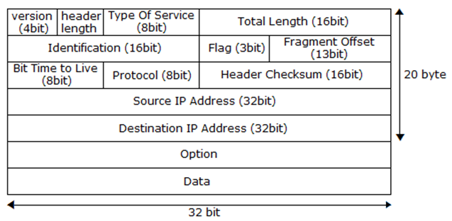

<h1> I/O Interface </h1>

<h2> Index </h2>

- [서론](#서론)
- [파이프(pipe)](#파이프pipe)
	- [익명 파이프(unnamed pipe)](#익명-파이프unnamed-pipe)
	- [pipe](#pipe)
	- [popen](#popen)
	- [pclose](#pclose)
- [명명된 파이프 (FIFO)](#명명된-파이프-fifo)
	- [mkfifo](#mkfifo)
	- [mkfifoat](#mkfifoat)
- [Byte Order](#byte-order)
	- [Byte Order Macro](#byte-order-macro)
- [소켓(Socket)](#소켓socket)
	- [socket](#socket)
	- [도메인에 의한 분류](#도메인에-의한-분류)
	- [타입에 의한 분류](#타입에-의한-분류)
	- [소켓 도메인](#소켓-도메인)
	- [소켓 타입](#소켓-타입)
	- [소켓 프로토콜](#소켓-프로토콜)
	- [소켓의 주요 조합](#소켓의-주요-조합)
- [유닉스 소켓](#유닉스-소켓)
	- [socket](#socket-1)
- [TCP 소켓 (SOCK\_STREAM)](#tcp-소켓-sock_stream)
	- [socket](#socket-2)
	- [bind](#bind)
	- [struct sockaddr](#struct-sockaddr)
	- [struct sockaddr\_strage](#struct-sockaddr_strage)
	- [struct sockaddr\_in](#struct-sockaddr_in)
	- [struct sockaddr\_in6](#struct-sockaddr_in6)
	- [listen](#listen)
	- [accept](#accept)
	- [connect](#connect)
	- [send](#send)
	- [recv](#recv)
	- [close](#close)
	- [shutdown](#shutdown)
- [UDP 소켓 (SOCK\_DGRAM)](#udp-소켓-sock_dgram)
	- [socket](#socket-3)
	- [bind](#bind-1)
	- [close](#close-1)
	- [shutdown](#shutdown-1)
	- [sendto](#sendto)
	- [recvfrom](#recvfrom)
- [TCP 소켓과 UDP 소켓의 차이](#tcp-소켓과-udp-소켓의-차이)
	- [데이터와 패킷](#데이터와-패킷)
	- [세그먼트와 프래그먼트](#세그먼트와-프래그먼트)
	- [재조합과 MTU](#재조합과-mtu)
- [프로토콜 헤더](#프로토콜-헤더)
	- [IP 헤더(IPv4)](#ip-헤더ipv4)
	- [TCP 헤더](#tcp-헤더)
	- [UDP 헤더](#udp-헤더)
- [TCP 기법](#tcp-기법)
	- [네이글 알고리즘](#네이글-알고리즘)
	- [지연ACK](#지연ack)
	- [슬라이딩 윈도우](#슬라이딩-윈도우)
	- [TCP autotuning](#tcp-autotuning)
- [UDP 기법](#udp-기법)
	- [UDP 브로드 캐스팅](#udp-브로드-캐스팅)
- [IPv6 소켓 프로그래밍 (보류 307~327p)](#ipv6-소켓-프로그래밍-보류-307327p)
- [소켓 옵션](#소켓-옵션)
	- [getsockopt, setsockopt](#getsockopt-setsockopt)
	- [SOL\_SOCKET 레벨 옵션](#sol_socket-레벨-옵션)
	- [IPPROTO\_TCP 레벨 옵션](#ipproto_tcp-레벨-옵션)
	- [SO\_REUSEADDR](#so_reuseaddr)
	- [SO\_RCVBUF, SO\_SNDBUF](#so_rcvbuf-so_sndbuf)
	- [SO\_RCVTIMEO, SO\_SNDTIMEO](#so_rcvtimeo-so_sndtimeo)
	- [SO\_LINGER](#so_linger)
	- [SO\_KEEPALIVE](#so_keepalive)
	- [SO\_OOBINLINE](#so_oobinline)
	- [SO\_RCVLOWAT, SO\_SNDLOWAT](#so_rcvlowat-so_sndlowat)
	- [TCP\_NODELAY](#tcp_nodelay)
	- [TCP\_MAXSEG](#tcp_maxseg)
	- [TCP\_CORK](#tcp_cork)
	- [IPV6\_V6ONLY](#ipv6_v6only)
- [기타 소켓 관련 함수 (보류 350~352p)](#기타-소켓-관련-함수-보류-350352p)
- [블로킹, 동기](#블로킹-동기)
- [블록킹 넌블록킹](#블록킹-넌블록킹)
- [동기 비동기](#동기-비동기)
- [아웃오브 밴드](#아웃오브-밴드)
- [공통 기법](#공통-기법)
- [sub-title](#sub-title)
	- [function\_name](#function_name)
- [**Parametters**](#parametters)
- [**Return Value**](#return-value)


## 서론
I/O Interface  
외부와 자료를 교환하기 위한 기능을 의미한다.  
파일, FIFO, 파이프, 소켓, mmap, 공유메모리, 세마포어, 메시지 큐 등이 포함된다.  
그중 파이프와 소켓에 대해 정리하였다.  


## 파이프(pipe)
익명 파이프(unnamed pipe) 와 명명된 파이프(named pipe)가 있다.  
읽기와 쓰기를 하는 프로세스가 존재한다.  
두 프로세스 모두가 열기를 진행할 때까지 블로킹에 걸리게 된다.  
이벤트 통지, 리다이렉션 같은 간단한 신호를 주고받는 용도로 사용된다.  

가장 쉽게 접할 수 있는 파이프는 리눅스에서의 '|' 문자이다.  
셸에서 익명파이프로 생성 되며 두 프로세스 사이의 출력과 입력을 연결한다. 


### 익명 파이프(unnamed pipe)
사용 후 pclose함수를 통해 닫아야한다.  
fclose나 close사용시 좀비프로세스가 생성될 가능성이 있다.  

popen 함수는 command에 해당하는 명령을 실행하며 fork 한다.  
보안에 취약하다는 단점이 있다.  


### pipe
	int pipe(int filedes[2]);
**Parametters**
-  `int filedes[2]` : 읽기, 쓰기 파일디스크립터를 반환받을 배열

**Return Value**
- `0` : 성공
- `-1` : 실패

**Description**  
성공시 2개의 파일디스크립터를 생성하여 배열로 반환한다.  
fork를 통해 부모, 자식 프로세스간 데이터를 교환할 때 사용된다.  
단방향 통신으로 만들어지며, 양방향 통신을 위해서는 두개의 파이프를 생성한다.  
filedes[0]	: 읽기전용  
filedes[1]	: 쓰기전용  


### popen
	FILE *popen(
		const char		*command,
		const char		*type
	)
**Parametters**
- `char *command` : 실행할 명령어
- `char *type`
  - "r" : 읽기모드 명령어가 표준출력으로 출력한 문자열을 읽을 수 있도록 함
  - "w" : 쓰기모드 명령어를 실행한 후 키보드로 데이터를 전송할 수 있도록 함
  
**Return Value**
- `other` : 파일포인터
- `NULL` : 생성 실패

**Description**  
command에 해당하는 명령을 실행하며 fork 한다.  
읽기모드와 쓰기모드로 생성 가능하다.  
FILE * 타입을 반환하지만 pclose로 닫아야 한다.  
외부 요인에 의해 크래킹될 수 있어 보안에 취약하다.  


### pclose
	int pclose(FILE *stream)
**Parametters**
- `FILE *stream` : 닫을 파일 스트림

**Return Value**
- `othre` : 성공
- `-1`	: 오류 발생 errno 설정

**Description**  
할당된 파이프 스트림을 해제한다.  
상대 프로세스의 종료까지 대기한 후 종료되면 return 된다.  
서브셸의 안전한 종료를 보장하는 기능이 있어 좀비 프로세스 생성을 막아준다.  


## 명명된 파이프 (FIFO)
외부에서 접근 가능한 이름(경로)이 있는 경우를 명명된 파이프(Named Pipe)또는 FIFO라고도 불린다.  
파일 경로에 특정 접근권한을 갖는 FIFO를 생성한다.  
open 함수를 통해 파이프에 접근 가능하다.  
read, write를 사용해 읽고 쓸수 있다.  
FIFO를 닫으면 수신측은 EOF가 수신된다.  
송신중인 모든 프로세스가 닫혀야 EOF가 반환된다.  
수신측은 O_RDONLY, 수신측은 O_WDONLY로 파일을 열어야 한다.  


### mkfifo
	int mkfifo(
		const char		*pathname,
		mode_t			mode
	)
**Parametters**
- `const char *pathname` : 파이프로 사용할 파일 이름
- `mode_t mode` : 파이프 접근 권한  

**Return Value**
- `0`	: 성공
- `-1`	: 실패 errno 설정

**Description**  
이름이 phthname인 FIFO 특수 파일을 만든다.  
송수신측이 모두 열려야 통신이 시작된다.  
외부에서 접근이 가능하다.  
생성 이후 open 함수를 통해 접근한다.  
수신측은 O_RDONLY, 수신측은 O_WDONLY로 파일을 열어야 한다.  


### mkfifoat
	int mkfifoat(
		int			fd,
		const char		*path,
		mode_t			mode
	)
**Parametters**
- `int fd` : 디렉터리의 기술자
- `const char *path` : 파이프로 사용할 파일 이름 (상대경로로 해석)
- `mode_t mode` : 파이프 접근 권한  

**Return Value**
- `0`	: 성공
- `-1`	: 실패 errno 설정

**Description**  
fd가 가리키는 위치에서 상대경로로 파일을 연다.  
배번 바뀌는 임시 디렉터리에 FIFO를 생성할 때 유용하다.  
이 때 fd는 파일이 아닌 디렉터리이다.  
생성 이후 open 함수를 통해 접근한다.  
수신측은 O_RDONLY, 수신측은 O_WDONLY로 파일을 열어야 한다.  

**Example**
``` c++
#include <fcntl.h>
#include <sys/stat.h>
#include <sys/types.h>
#include <unistd.h>
#include <stdio.h>

int main() {
	int fd;
	int ret = mkfifoat(fd, "myfifo", 0666);
	if (-1 == ret) {
		perror("mkfifoat error");
		return 1;
	}
	fd = open("myfifo", O_RDONLY);
	if(-1 == fd){
		perror("open error")
	}

	printf("Named pipe created successfully\n");
	close(fd);
	return 0;
}
```


## Byte Order
원격 호스트와 데이터 통신할 때 꼭 지켜야하는 표현 규칙  
멀티바이트의 데이터를 표현할 때 사용하는 두 가지 표현법  
네트워크 통신의 경우 빅엔디안 방식을 사용한다.  

0x00124F80 숫자의 표현법
|          |        빅엔디안 (Big Endian)        |        |      리틀 엔디안 (Little Endian)      |             |
| :------: | :---------------------------------: | :----: | :-----------------------------------: | :---------: |
|          |    낮은 주소에 큰 자릿수가 저장     |        |     높은 주소에 큰 자릿수가 저장      |             |
|          | 숫자의 가장 큰 자릿수 부분부터 저장 |        | 숫자의 가장 낮은 자릿수 부분부터 저장 |             |
|          |            네트워크 통신            |        |             인텔 계열 CPU             |             |
|          |                                     |  주소  |                                       |             |
|          |                0x80                 | 0x0003 |                 0x00                  | little base |
|          |                0x4F                 | 0x0002 |                 0x12                  |             |
|          |                0x12                 | 0x0001 |                 0x4F                  |             |
| big base |                0x00                 | 0x0000 |                 0x80                  |             |


### Byte Order Macro
	uint32_t htonl(uint32_t hostlong)
	uint16_t htons(uint16_t hostshort)
	uint32_t ntohl(uint32_t netlong)
	uint16_t ntohs(uint16_t netshort)
**Parametters**
- 해당 바이트오더로 변환할 값

**Return Value**
- 바이트오더에 맞게 변환된 숫자

**Description**  
각 바이트 오더에 맞는 숫자로 변환해준다.  
같은 방식을 사용하고 있는 경우라면 변환이 일어나지 않는다.  
h : host	(Little Endian)  
n : network	(Big Endian)  


## 소켓(Socket)
I/O 인터페이스중 가장 많이 사용된다.  
파이프와 동일하게 read, write, close를 사용한다.  
대부분의 운영체제가 BSD 소켓 인터페이스를 따르고 있다.  
통신 가능한 장치에 입출력이 가능한 파일을 탑재하는 형태를 띄고있다.  


### socket
	int socket(
		int			domain,
		int			type,
		int			protocol
	)
**Parametters**
- `int domain` 
	 | AF_UNIX  | 유닉스 도메인 소켓 (AF_LOCAL로도 가능) |
	 | :------: | :------------------------------------- |
	 | AF_INET  | IPv4 네트워크 도메인 소켓              |
	 | AF_INET6 | IPv6 네트워크 도메인 소켓              |
- `int type` 
	 | SOCK_STREAM | 스트림 소켓     |
	 | :---------: | :-------------- |
	 | SOCK_DGRAM  | 데이터그램 소켓 |
	 |  SOCK_RAW   | raw 소켓        |
- `int protocol`
	 |  IPPROTO_IP  | IP 프로토콜 사용   |
	 | :----------: | :----------------- |
	 | IPPROTO_TCP  | TCP 프로토콜 사용  |
	 | IPPROTO_UDP  | UDP 프로토콜 사용  |
	 | IPPROTO_ICMP | ICMP 프로토콜 사용 |
**Return Value**
- `other`	: 파일디스크립터
- `-1`		: 실패, errno 설정

**Description**  
소켓을 생성한다.  
이 때 생성된 소켓은 빈 소켓이다.  
bind 이후 입출력 인터페이스를 가질 수 있다.  
도메인, 소켓 타입, 프로토콜은 특정 조합에 따라 사용된다.  


### 도메인에 의한 분류
도메인 : 소켓으로 통신할 수 있는 범위의 분류  
유닉스 도메인 소켓 : 유닉스 계열에서만 사용 가능한 소켓  
네트워크 도메인 소켓 : 네트워크 계층 내에 특정 네트워크 주소에 연결 가능한 소켓  
|         도메인         | 유닉스 소켓 |       네트워크 소켓       |
| :--------------------: | :---------: | :-----------------------: |
|    외부 인터페이스     |  파일 경로  | 네트워크 주소(IP,port 등) |
|      원격지 연결       |   불가능    |           가능            |
| 유닉스 계열 외 OS 지원 |   불가능    |           가능            |


### 타입에 의한 분류
데이터그램 소켓 : 사용자가 정한 데이터그램 단위로 전송  
스트림 소켓 : 통로를 연결해 데이터를 전송  
|			| 데이터그램 소켓	| 스트림 소켓		|
| :--:			| :--:			| :--:			|
| 데이터 경계 		| 파일 경로		| 보존 안 됨		|
| 데이터 크기 제한 	| 보존 됨		| 없음			|
| 데이터 순서 		| 보존 안 됨		| 보존됨		|
| 연결 과정 		| 필요 없음 (1:n 통신)	| 필요함 (1:1 통신)	|
| 신뢰 			| 낮음 (유실 시 복구 X)	| 높음 (데이터 유실시 재전송) |


### 소켓 도메인
AF_접두어는 Address Family의 의미이다.  
PF_접두어를 사용하는 경우도 있으며, Protocol Family의 의미를 갖는다.  


### 소켓 타입
|  SOCK_RAW   | 프로토콜 헤더를 포함한 원시적인 패킷을 볼 수있는 소켓을 사용한다.</br>주로 모니터링 프로그램이나 패킷에 변경을 줄 때 사용한다.                                                           |
| :---------: | :--------------------------------------------------------------------------------------------------------------------------------------------------------------------------------------- |
| SOCK_STREAM | 연결 지향성 1:1 통신을 한다.</br>데이터 순서(byte order)와 재전송을 해준다.                                                                                                              |
| SOCK_DGRAM  | 비연결 지향성 1:n 통신 방식이다.</br>초기 연결이나 해제, 제어에 관련된 절차가 없어 상대적으로 오버헤드가 적다.</br>일회성 데이터, 응답이 필요없는 작은 데이터 조각을 전송할 때 유리하다. |


### 소켓 프로토콜
IPPROTO_IP	: 지정된 소켓 타입에 따라 프로토콜을 자동으로 설정 (0값을 가짐)  
IPPROTO_TCP	: TCP 프로토콜  
IPPROTO_UDP	: UDP 프로토콜  
IPPROTO_ICMP	: ICMP 프로토콜  


### 소켓의 주요 조합
<table>
<tr>	<td align="center"> Domain </td>
	<td align="center"> Type </td>
	<td align="center"> Protocol </td>
</tr>
<tr>	<td rowspan=3>AF_UNIX</td>
		<td> SOCK_STREAM </td>
		<td> 0</td>
	<tr>	<td> SOCK_DGRAM </td>
		<td> 0</td>
	</tr>
	<tr>	<td> SOCK_RAW </td>
		<td> 0, IPPROTO_ICMP</td>
	</tr>
</tr>
<tr>	<td rowspan=3>AF_INET</td>
		<td> SOCK_STREAM </td>
		<td> 0, IPPROTO_TCP</td>
	<tr>	<td> SOCK_DGRAM </td>
		<td> 0, IPPROTO_UDP</td>
	</tr>
	<tr>	<td> SOCK_RAW </td>
		<td> IPPROTO_RAW, IPPROTO_ICMP, IPPROTO_UDP,</br> IPPROTO_TCP </td>
	</tr>
</tr>
<tr>	<td rowspan=3>AF_INET6</td>
		<td> SOCK_STREAM </td>
		<td> 0, IPPROTO_TCP</td>
	<tr>	<td> SOCK_DGRAM </td>
		<td> 0, IPPROTO_UDP</td>
	</tr>
	<tr>	<td> SOCK_RAW </td>
		<td> IPPROTO_RAW, IPPROTO_ICMPV6, IPPROTO_ICMP,</br> IPPROTO_UDP, IPPROTO_TCP</td>
	</tr>
</tr>
</table>


## 유닉스 소켓
도메인 범위가 로컬 호스트에 국한되어 IPC의 일종으로 쓰인다.  
네트워크 도메인 소켓으로 쉽게 전환할 수 있다.  
메시지 큐와 성격이 비슷하다.  


### [socket](#socket)
```cpp
#include<sys/un.h>

	int sockfd = socket(AF_UNIX, SOCK_STREAM, IPPROTO_IP);
```


## TCP 소켓 (SOCK_STREAM)
데이터 전송 시 데이터의 경계를 보존하지 않는다.  
따로 어플리케이션 헤더를 만들거나 경계를 구분할 수 있는 구분자를 사용해야 한다.  
소켓에는 읽기채널과 쓰기채널이 존재하며 수신버퍼와 송신버퍼가 따로있다.  
흐름 제어를 하기때문에 통신이 실시간으로 일어나지 않을 수 있다.  
수신을 정교하고 빠르게 처리하는 것이 중요하다.  

  
클라이언트 측에서도 bind가 일어난다.  
server side	: socket -> bind -> listen  
client side	: socket (+ bind) -> connect  
active close	: close, shutdown 함수를 호출한 행위  
passive close	: 연결 종료 요청을 받아 close 함수를 호출하는 행위  


### [socket](#socket)
```cpp
	int sockfd = socket(AF_INET, SOCK_STREAM, IPPROTO_IP);
```
TCP 소켓을 생성한다.


### bind
	int bind(
		int			sockfd,
		const struct sockaddr	*addr,
		socklen_t		addrlen
	)
**Parametters**
- `int sockfd`	: socket함수로 생성한 파일디스크립터
- `struct sockaddr *addr`
  - 바인드 할 외부 인터페이스 정보 구조체
  - 빅엔디안으로 저장되어야 한다.
  - 아래는 sockaddr_* 구조체이다.
  - (struct sockaddr *) 타입으로 캐스팅해 사용한다.
 |          | sockadr_* 구조체 명 |
 | :------: | :-----------------: |
 | AF_INET  | struct sockaddr_in  |
 | AF_INET6 | struct sockaddr_in6 |
 | AF_UNIX  | struct sockaddr_un  |
- `socklen_t addrlen`	: sockaddr 구조체의 크기

**Return Value**
- `0`	: 성공
- `-1`	: 에러, errno 설정 

**Example**
``` cpp
	struct sockaddr_in saddr = {};
	listen_port = 8080;
	saddr.sin_family = AF_INET;		// IPv4
	saddr.sin_port = htons(listen_port);	// 빅엔디안 변환
	saddr.sin_addr.s_addr = INADDR_ANY;	// 로컬호스트의 모든 주소(0.0.0.0)
	sd = socket(AF_INET, SOCK_STREAM, IPPROTO_IP);
	int ret = bind(sockfd,
		(struct sockaddr *) &saddr,
		sizeof(struct sockaddr_in));
```
**Description**  
소켓을 시스템에 부착하여 외부로부터 연결점을 갖는다.  
빈 소켓에 시스템 장치와 통신할 수 있도록 이름을 부여하는 과정이다.  
어떤 소켓 도메인을 사용하는지에 따라 세부 작업이 달라진다.  
클라이언트 측에서는 connect 과정에서 bind를 내포한다.  
connect를 통해 실행하는 경우 비어있는 포트를 순서대로 또는 랜덤으로 지정한다.  


### struct sockaddr
과거에 쓰였던 IPv4 전용 구조체  
sockaddr_in 구조체와 sockaddr_un을 감싸기위해 만들어졌다.  
```cpp
	struct sockaddr{
		sa_family_t		sa_family;	// Address family
		char			sa_data[];	// 가변길이 사용
	};
```


### struct sockaddr_strage
IPv4, IPv6를 모두 포함하는 새로운 구조체  
sockaddr_in6 구조체를 추가적으로 감싸기 위해 만들어졌다.  
```cpp
	struct sockaddr_storage{
		sa_family_t	sa_family;
		// 정렬을 위한 패딩 
	};
```


### struct sockaddr_in
``` cpp
	struct sockaddr_in{
		sa_family_t		sin_family;	// AF_INET
		in_port_t		sin_port;	// uint16_t
		struct in_addr		sin_addr;	// IPv4 32Bits
		char sin_zero[8];	// Not used (add padding)
	};
	struct in_addr{
		in_addr_t 		s_addr		// uint32_t
	};
```


### struct sockaddr_in6
``` cpp
	struct sockaddr_in6{
		sa_family_t		sin6_family;	// AF_INET6
		in_port_t		sin6_port;	// uint16_t
		uint32_t		sin6_flowinfo;	
		struct in6_addr		sin6_addr;	// IPv6 128Bits
		uint32_t		sin6_scope_id;
	};
	struct in6_addr{
		uint8_t			s6_addr[16];
	};
```


### listen
	int listen(
		int		socket,
		int		backlog
	)
**Parametters**
- `int socket` : bind된 파일디스크립터
- `int backlog` : 연결 대기큐의 크기 (2의 제곱수를 주로 사용)

**Return Value**
- `0` : 성공
- `-1` : 에러, errno 설정 

**Description**  
외부로부터 TCP 연결을 받아들일 수 있도록 연결큐를 만들어 대기한다.  
재호출 시 대기큐의 크기를 변경할 수 있다.  


### accept
	int accpet(
		int				sockfd, 
		struct sockaddr *restrict	address, 
		socklen_t *restrict		address_len
	)
**Parametters**
- `int sockfd`		: connect요청을 수락할 파일디스크립터
- `struct sockaddr *restrict address`
  - 접속을 시도한 클라이언트의 주소 정보
  - sockaddr_* 구조체, sockaddr 구조체로 캐스팅 해야 함
  - 필요 없다면 NULL로 지정
- `socklen_t *restrict address_len`
  - sockaddr 구조체의 실제 크기
  - 필요 없다면 NULL로 지정

**Return Value**
- `other` : 요청을 수락한 소켓 파일디스크립터
- `-1` : 에러, errno 설정 

**Description**  
클라이언트 측에서 보낸 접속 요청을 받아들인다.  
백로그에 여유가 있는 경우 접속요청을 받아들인다.  
새로운 연결이 도착할 때 까지 블록상태로 대기한다.  
accept가 루프를 도는 경우 매 루프마다 sockaddr 매개변수를 설정해서 넣어야 한다.  


### connect
	int connect(
		int			socket,
		cosnt struct socaddr	*address,
		socklen_t		address_len
	)
	
**Parametters**
- `int socket`			: socket함수(bind)로 생성한 파일디스크립터
- `struct socaddr *address`	: sockaddr_* 구조체, sockaddr 구조체로 캐스팅 해야 함
- `socklen_t address_len`	: sockaddr 구조체의 크기

**Return Value**
- `0`	: 성공
- `-1`	: 에러, errno 설정 

**Description**  
listen상태의 서버에 연결을 시도한다.  
connect 성공 시 해당 소켓은 통신 가능상태가 되어 데이터를 주고받을 수 있다.  


### send
	ssize_t send(
		int			sockfd,
		const void		*buffer,
		size_t			length,
		int			flags
	)
	
**Parametters**
- `int sockfd` : 소켓 파일디스크립터
- `void *buffer` : 보낼 데이터의 버퍼
- `size_t length` : 버퍼에 담긴 데이터의 크기
- `int flags`
  - 작동 플래그
   |     옵션     | 설명                                                                                                                      |
   | :----------: | :------------------------------------------------------------------------------------------------------------------------ |
   |      0       | write와 동일하게 동작한다.                                                                                                |
   |   MSG_OOB    | 아웃오브밴드 데이터를 송신한다.                                                                                           |
   | MSG_NOSIGNAL | 반대편 소켓 연결이 끊어졌을 대 SIGPIPE 시그널을 발생시키지 않는다.</br>EPIPE 에러 설정은 여전히 작동한다.                 |
   | MSG_DONTWAIT | 1회성 넌블록킹 작동을 한다.                                                                                               |
   |   MSG_EOR    | 레코드의 끝을 알리는 EOR을 지정한다.                                                                                      |
   |   MSG_MORE   | 1회성으로 TCP_COR 옵션 기능을 사용한다.(리눅스전용)</br>데이터를 모아 MORE명령이 없는 전송시도가 있을 때 한번에 전송한다. |
	
**Return Value**
- `other`	: 데이터 복사에 성공한 바이트 크기
- `-1`	: 에러, errno 설정 

**ErrorCode**
|    EAGIN    | 넌블로킹으로 세팅된 소켓에서 소켓 버퍼에 공간이 없는 경우</br>보통의 경우 재전송시도를 한다. |
| :---------: | :------------------------------------------------------------------------------------------- |
| EWOULDBLOCK | 넌블로킹으로 세팅된 소켓에서 소켓 버퍼에 공간이 없는 경우</br>보통의 경우 재전송시도를 한다. |
|   EINTER    | 인터럽트가 발생하여 전송이 중단된다.</br>보통의 경우 재전송시도를 한다.                      |
|    EPIPE    | 반대편 소켓의 연결이 끊어졌다.</br>보통의 경우 연결을 닫고 정리한다.                         |
| ECONNRESET  | 반대편에서 연결을 강제로 끊는다.</br>보통의 경우 연결을 닫고 정리한다.                       |

**Description**  
소켓으로 데이터를 송신한다.  
옵션이 없다면 write와 동일한 동작을 진행한다.  
송신 데이터 크기와 복사에 성공한 크기가 다르다면 나머지부분은 계산해서 재전송해야한다.  


### recv
	ssize_t recv(
		int			sockfd,
		void			*buffer,
		size_t			length,
		int			flags
	)

**Parametters**
- `int sockfd` : 소켓 파일디스크립터
- `void *buffer` : 데이터를 저장할 버퍼
- `size_t length` : 데이터를 저장할 버퍼의 크기
- `int flags` 
  - 작동 플래그
   |    옵션     | 설명                                                                                            |
   | :---------: | :---------------------------------------------------------------------------------------------- |
   |      0      | read와 동일하게 동작한다                                                                        |
   |   MSG_OOB   | 아웃오브밴드 데이터를 수신한다                                                                  |
   |  MSG_PEEK   | recv가 성공한 뒤에도 소켓 수신 버퍼큐에서 데이터를 제거하지 않는다.                             |
   | MSG_WAITALL | 버퍼 크기가 다 채워질 때까지 대기한다.</br>시그널 개입이나 연결이 끊어진 경우엔 에러로 리턴한다 |
   |  MSG_TRUNC  | recv 호출시 사용한 버퍼보다 큰 데이터를 수신해야 하는 경우 초과분을 삭제한다.                   |

**Return Value**
- `other`	: 데이터 수신에 성공한 바이트 크기
- `0`	: 상대측의 연결 종료요청
- `-1`	: 에러, errno 설정 

**Description**  
소켓으로부터 데이터를 송수신한다.  
옵션이 없다면 read와 동일한 동작을 진행한다.  
리턴된 값이 length값과 같다면 남아있는 데이터가 있을 수 있다.  
나머지 데이터를 읽어와야 할 수 있으며 멀티플렉싱 기법을 주소 사용한다(I/O 7장 멀티플렉싱)  


### [close](../etc.md#close)
파일디스크립터를 닫는다.  
해당 프로세스 내에서 소켓 ID를 닫는다.  

### shutdown
	int shutdown(
		int			socket,
		int			how
	)
**Parametters**
- `int socket`	: 닫을 소켓 파일디스크립터
- `int how`
  - 닫을 채널과 방법
 |   옵션    | 설명                                                                                                                           |
 | :-------: | :----------------------------------------------------------------------------------------------------------------------------- |
 |  SHUT_RD  | 읽기 채널을 닫는다.</br>해당 소켓에 읽기 행동을 할 수 없다.                                                                    |
 |  SHUT_WR  | 쓰기 채널을 닫는다.</br>해당 소켓에 쓰기 행동을 할 수 없다.</br>명령이 성공하면 상대방에게 소켓을 닫기위한 신호(FIN)를 보낸다. |
 | SHUT_RDWR | 소켓을 즉시 닫는다.                                                                                                            |

**Return Value**
- `0`	: 성공
- `-1`	: 에러, errno 설정 

**Description**  
소켓에 EOF신호를 보내 연결된 모든 소켓을 닫는다.  
TCP half-close	: 송수신 채널 중 하나만 닫는 행위, 특수한 경우에만 사용된다.  

SHUT_RD	: 읽기 채널을 닫아 수신 버퍼를 제거한다.  
상대편에서 오는 데이터를 모두 무시하고 송신할 데이터만 보내고 끊는 경우에 사용한다.  

SHUT_WD	: 쓰기 채널을 닫아 송신 버퍼를 제거한다.  
상대편에게 더이상 보낼 데이터는 없으며, 수신할 데이터만 남은 경우 사용한다.  
상대방은 데이터를 다 보낸 뒤 recv를 하면 0이 리턴되어 close나 shutdown을 시도한다.  

SHUT_RDWR	: 소켓을 즉시 닫는다.  
close를 호출하는 경우 즉시 리턴되지만 연결이 바로해제되는 것이 아니다.  
전송되지 못한 데이터가 소켓 버퍼에 남아있다면 백그라운드에서 처리하고 연결을 끊기 때문이다.  


## UDP 소켓 (SOCK_DGRAM)
연결 과정이 없고 가볍다.  
데이터 경계면을 보존하여 송 수신횟수가 동일하다.  
데이터가 유실될 가능성이 존재하며, 수신 순서가 뒤집힐 수 있다.  
실패, 오버플로우 발생의 경우에도 재전송하지 않는다.  
재전송이 필요하다면 프로그래머가 따로 구현해야한다.  
한 번의 전송으로 여러 호스트에게 데이터를 보낼 수 있다.(브로드캐스트, 멀티캐스트)  
connect 함수를 사용하는 경우 send, write를 사용해도 된다.  
connect 함수를 사용하는 경우 sockaddr 구조체에 관련된 부분을 자동으로 채워준다.  


### [socket](#socket)
```cpp
	int sockfd = socket(AF_INET, SOCK_DGRAM, IPPROTO_IP);
```
UDP 소켓을 생성한다.


### [bind](#bind)
소켓을 시스템에 부착하며, 외부로부터 연결점을 갖는다.  


### [close](../etc.md#close)
파일디스크립터를 닫는다.  
해당 프로세스 내에서 소켓 ID를 닫는다.  


### [shutdown](#shutdown)
소켓에 EOF신호를 보내 연결된 모든 소켓을 닫는다.  


### sendto
	ssize_t sendto(
		int			socket,
		const void		*messsage,
		size_t			length,
		int			flags,
		const struct sockaddr 	*dest_addr,
		socklen_t		dest_len
	)
**Parametters**
- `int socket` : 소켓 파일디스크립터
- `void *messsage` : 보낼 데이터의 버퍼
- `size_t length` : 버퍼에 담긴 데이터의 크기
- `int flags`
  - 작동 플래그
	   |     옵션     | 설명                                                                                                                       |
	   | :----------: | :------------------------------------------------------------------------------------------------------------------------- |
	   |      0       | write와 동일하게 동작한다.                                                                                                 |
	   |   MSG_OOB    | 아웃오브밴드 데이터를 송신한다.                                                                                            |
	   | MSG_NOSIGNAL | 반대편 소켓 연결이 끊어졌을 대 SIGPIPE 시그널을 발생시키지 않는다.</br>EPIPE 에러 설정은 여전히 작동한다.                  |
	   | MSG_DONTWAIT | 일회성 넌블록킹 작동을 한다.                                                                                               |
	   |   MSG_EOR    | 레코드의 끝을 알리는 EOR을 지정한다.                                                                                       |
	   |   MSG_MORE   | 일회성으로 TCP_COR 옵션 기능을 사용한다.(리눅스전용)</br>데이터를 모아 MORE명령이 없는 전송시도가 있을 때 한번에 전송한다. |
- `struct sockaddr *dest_addr` : 목적지 주소 [struct sockaddr](#struct-sockaddr)
- `socklen_t dest_len` : 실제로 사용된 scokaddr의 크기


**Return Value**
- `other`	: 전송에 성공한 바이트 크기
- `-1`	: 에러, errno 설정 

**Description**  
소켓으로 데이터를 송신한다.  


### recvfrom
	ssize_t recvfrom(
		int			socket,
		void *restrict		buffer,
		size_t			length,
		int			flags,
		const struct sockaddr *restrict		address,
		socklen_t *restrict	address_len
	)
**Parametters**
- `int socket` : 소켓 파일디스크립터
- `void *buffer` : 받을 데이터의 버퍼
- `size_t length` : 데이터를 저장할 버퍼의 크기
- `int flags`
  - 작동 플래그
	   |    옵션     | 설명                                                                                            |
	   | :---------: | :---------------------------------------------------------------------------------------------- |
	   |      0      | read와 동일하게 동작한다                                                                        |
	   |   MSG_OOB   | 아웃오브밴드 데이터를 수신한다                                                                  |
	   |  MSG_PEEK   | recv가 성공한 뒤에도 소켓 수신 버퍼큐에서 데이터를 제거하지 않는다.                             |
	   | MSG_WAITALL | 버퍼 크기가 다 채워질 때까지 대기한다.</br>시그널 개입이나 연결이 끊어진 경우엔 에러로 리턴한다 |
	   |  MSG_TRUNC  | recv 호출시 사용한 버퍼보다 큰 데이터를 수신해야 하는 경우 초과분을 삭제한다.                   |
- `struct sockaddr *address` : 송신 상대방의 주소 [struct sockaddr](#struct-sockaddr)
- `socklen_t *address_len` : address의 크기 IPv4, IPv6에 따라 달라진다.

**Return Value**
- `other`	: 수신받은 데이터의 바이트 크기
- `-1`	: 에러, errno 설정 

**Description**  
소컷으로 데이터를 수신한다.


## TCP 소켓과 UDP 소켓의 차이
|             | TCP                                                                                                                                                                                                       | UDP                                                                                                                                                                          |
| :---------: | :-------------------------------------------------------------------------------------------------------------------------------------------------------------------------------------------------------- | :--------------------------------------------------------------------------------------------------------------------------------------------------------------------------- |
|  연결 상태  | 연결 상태를 알 수 있다.</br>연결을 맺거나 끊기 위한 과정에서 약간의 오버헤드가 발생한다.                                                                                                                  | 연결이 없어 알 수 없다.</br>가볍게 사용 가능하며, 연결에 따른 부담이 없다.                                                                                                   |
| 데이터 크기 | 바이트 스트림으로 처리되어 크기제한이 없다.</br>송신 버퍼에 있는 데이터는 MSS 크기로 세그먼테이션되어 전송된다.                                                                                           | UDP프로토콜 상의 제한 (65527)이나 소켓 버퍼 크기에 영향을 받는다.                                                                                                            |
|   단편화    | MSS크기로 세그먼테이션하므로 프래그먼테이션은 발생하지 않는다.(MSS < MTU)</br>수신처의 수신 대기큐는 들어오는 세그먼트를 처리하여 재조합을 한다.</br>누락되면 재전송되어 도착할 때까지 재조합은 보류된다. | IP계층에서 단편화가 일어난다.</br>자체적으로 세그먼테이션하지 않음</br>조각난 단편 중 하나가 유실되거나 체크섬에 실패한 데이터그램은 삭제된다.</br>재전송은 일어나지 않는다. |
|  흐름제어   | 슬라이딩 윈도우를 사용하여 흐름제어를 보장한다.                                                                                                                                                           | 흐름제어를 하지 않는다.</br>전송이 요청되면 곧바로 송신한다.</br>수신처에서 오버플로우될 수 있다.                                                                            |
|  에러 처리  | 체크섬으로 검증</br>실패시 TCP 프로토콜상에서 재전송한다.                                                                                                                                                 | 체크섬으로 검증</br>실패시 요청은 삭제된다.                                                                                                                                  |


### 데이터와 패킷
데이터 : 사용자가 실제로 보내고자 하는 값  
패킷 : 데이터에 통신 및 제어용으로 사용되는 헤더가 더해진 경우  

페이로드  
- 사용에 있어서 전송되는 데이터  
- 페이로드의 앞에는 통신계층에 따라 헤더가 중첩되기 때문에 데이터와는 다르다.  
데이터그램 : 전송하고자 하는 데이터가 일정한 단위를 가진 경우  


### 세그먼트와 프래그먼트
세그먼트 (Segment)
- 세그먼테이션 (segmentation)
- 데이터를 조각으로 나눈 분절  
- 원본의 크기와 데이터의 경계를 알 수 없다.
- TCP에서 사용하는 방식
  
프래그먼트 (Fragment)
- 프래그먼테이션(fragmentation)
- 데이터를 조각으로 나눈 분절
- 원본의 형태를 보존한다.
- 재조합(reassembly)을 통해 원본 데이터를 재현할 수 있다.
- UDP에서 사용하는 방식


### 재조합과 MTU
MTU : (Maximum Transmission Unit)패킷에 담을 수 있는 데이터의 최대크기
- 프래그먼트를 나누는 기준
- 이더넷의 경우 1500바이트가 일반적
- 데이터링크 계층에서 주고받는 데이터그램의 최대 단위
- 모든 프로토콜은 MTU 크기를 따른다.  
  
path MTU : 두 호스트 사이에 존재하는 네트워크 장비 중 가장 작은 MTU  
단편화 : (fregmentation) MTU 값에 맞춰 데이터를 쪼개는 행위 (UDP에서만 발생한다.)


## 프로토콜 헤더
헤더의 정보는 각 프로토콜의 제약에 영향을 미친다.  
각 헤더의 크기를 알아야 실제 데이터와 패킷의 크기가 달라지는 크기와 비율을 알 수 있다.  
헤더의 크기는 word의 배수로 지정된다.  


### IP 헤더(IPv4)
기본적으로 20byte이다.  

  

version	: IP프로토콜의 버전 (IPv4 : 4, IPv6 : 6)  
header : 헤더의 길이, 워드 단위를 사용한다. (기본으로 5 지정 : 20byte)  
type of service : 특정 규칙에 따라 패킷을 처리하도록 한다. [RFC3168](https://datatracker.ietf.org/doc/html/rfc3168)  

Total Length
- IP 패킷의 길이
- IP길이가 MTU보다 크다면 단편화가 발생한다.
- 단편화가 발생하면 식별자(Identification) 정보가 필요하게 된다.

Identification : 식별자 정보, 라우팅에서 중복 검사에도 사용한다.  

Flag
- DF와 MF가 있다. 
  - DF (Don't Fragment)
    - 단편화 작업을 하지 않는다.
    - 패킷의 크기가 MTU보다 크다면 전송하지 않고 폐기한다.
  - MF (More Freagmentation)
    - 추가로 단편화된 서브 패킷이 존재한다.
    - Fregment Offset을 이용하게 된다.

Fregment Offset
- 단편화된 상대적인 위치 정보를 가리킨다.
- 이 정보를 통해 단편화된 데이터를 순서에 맞게 재조합할 수 있다.
- 단편화된 마지막 서브 패킷은 플래그에 0이 지정되나.

TTL (Time To Live)
- 네트워크상에서 패킷의 수명을 의미한다.
- 한개의 노드를 지날 때마다 1씩 감소한다.
- 패킷이 오랫동안 살아남아 네트워크를 어지럽히는 것을 방지한다.  

Protocol : 패킷이 사용하는 전송(Transport)계층의 프로토콜  
| ICMP	| 1, Internet Control Message Protocol |
| :--	| :-- |
| IGMP	| 2, Internet Group Management Protocol |
| TCP	| 6, Transaction Control Protocol |
| UDP	| 17, User Datagram Protocol |

Checksum : 데이터의 오류를 발견하기위한 정보 (checksum offload 기능이 NIC에 탑재되기도 함)  

Source IP Address : 송신측 IP 주소  
Destination IP Address : 수신측 IP 주소  


### TCP 헤더
기본적으로 20byte이나 플래그 값에 따라 늘어날 수 있다.  
용도에 따라 옵션필드를 추가할 수 있다.  
각 옵션은 고정된 위치를 갖는다.  

  

Source port : 송신측 포트 번호  
Destination port : 수신측 포트 번호  
Sequnce number : 패킷의 시퀀스 번호, 세그먼트의 연속된 데이터 번호  
ACK number : (Acknowledgement) 상대로부터 받아야하는 다음 세그먼트 번호  
Data Offset : 헤더의 길이, 워드 단위를 사용한다. (기본 5, 옵션 필드 5개 추가시 10으로 지정 40byte)  
Reserved : 예약 영역, 아직 사용하지 않는다.  
Flags
- 제어 플래그들  
  
| 플래그 | 설명 |
| :--:	| :-- |
| URG	| 긴급 데이터</br>Urgent 뒤의 urgent pointer 필드를 사용함 |
| ACK	| acknowledgement 앞의 ack number 필드를 사용함 |
| PSH	| push</br>현재 세그먼트 데이터는 즉시 전달되어야 함 |
| PST	| reset</br>현재 연결을 재설정함 |
| SYN 	| synchronization</br>새로운 연결 설정을 요구함 |
| FIN	| finish</br>연결의 종료를 요구함 |
| NS	| ECN-nonce concealment protection</br>CWR, ECE 필드를 실수 또는 악의적인 은폐 보호 |
| CWR	| congestion Window Reduced</br>혼잡제어 윈도우 크기를 축소함을 알림 |
| ECE	| ECN-echo</br>혼잡통지 |  

Window Size : TCP 슬라이딩 윈도우의 윈도우 크기아다.  
Checksum : 데이터의 오류를 발견하기위한 정보 (checksum offload 기능이 NIC에 탑재되기도 함)  
Urgent pointer
- 전송데이터 중 빨리 처리하기를 바라는 데이터의 위치를 가르키는 포인터
- URG 플래그가 설정되면 긴급 포인터가 가리키는 위치를 따로 읽을 수 있다.
- 긴급 포인터를 이용하는 전송을 OOB(Out Of Band)데이터라고 부른다.


### UDP 헤더
8Byte로 고정된다.  

  

Source port : 송신측 포트 번호  
Destination port : 수신측 포트 번호  
Data Length : 헤더를 제외한 실제 전송 가능 데이터는 65527  
Checksum : 데이터의 오류를 발견하기위한 정보 (checksum offload 기능이 NIC에 탑재되기도 함)  


## TCP 기법
### 네이글 알고리즘
짧은 시간동안 작은 패킷을 모아 ACK가 수신되면 전송하도록 한다.  
너무 작은 데이터그램은 네트워크 구간에서 혼잡을 일으키기 때문에 사용한다.  
200msec 정도의 시간동안 작은 패킷을 모아두었다가 ACK가 수신되면 전송하도록 하는 알고리즘이다.  
상대편의 빠른 응답으로 ACK가 빨리 수신되면 빨리 송신되어 흐름제어 역할도 병행한다.  


### 지연ACK
수신측의 작은 ACK 패킷에 의한 혼잡을 피하기위한 방법이다.  
수신측에서 응답이 필요할 때 패킷을 포장하며 ACK 번호를 실어 보낸다.  
응답 패킷에 ACK 번호를 함께 실어보내 ACK 패킷을 따로보내지 않아도 된다.  

ACK(긍정 응답 패킷) : TCP 프로토콜에서 수신측이 패킷을 받았음을 알리는 응답 패킷  
피기백 : 수신측에서 전송할 데이터가 있을 때만 데이터프레임에 확인값을 덧붙여 전송하는, 오류제어 및 흐름제어 방식  

보류된 ACK 전송 조건
1. 타임아웃
   - 타임아웃 권장 시간은 500msec 이내를 권고하고있다.
   - 대부분의 운영체제는 200msec 이내의 시간을 사용한다.
   - 이로 인해 200 msec 이내의 송신 지연이 발생한다.
2. 수신측의 읽기요청으로인해 버퍼가 비워질 때
   - recv 함수같은 읽기 요청으로 버퍼가 비워지는 경우에 발생한다.
   - 많은 데이터를 읽은 경우 슬라이딩 윈도우 크기 조정을위한 응답 패킷을 보낸다. 이 때 ACK 필드를 채워 보낸다.
   - 슬라이딩 윈도우의 절반 이상의 데이터를 읽은 경우, MSS 크기의 두배 이상의 데이터를 읽은 경우가 해당된다.

setcokopt를 통해 소켓 옵션을 TCP_NODELAY로 설정하면 네이글 알고리즘을 비활성화 할 수 있다.  
``` cpp
	int option = TRUE;			// 네이글 알고리즘 on/off
	setsockopt(m_Socket,			// 해당 소켓
	           IPPROTO_TCP			// 소켓의 레벨
	           TCP_NODELAY,			// 설정 옵션
	           (const char*)&option,	// 옵션 포인터
	           sizeof(option));		// 옵션 크기
```


### 슬라이딩 윈도우
윈도우 : 수신측에서 받을 수 있는 버퍼의 크기  
패킷의 연속 전송과 흐름제어에 가장 중요한 기술이다.  
TCP프로토콜과 같은 신뢰성 프로토콜은 수신 확인으로 ACK 응답을 받는다.  
매번 송신 후 ACK응답을 받는다면 전송 속도가 줄어들 가능성이 매우 크다.  

송신측은 수신측 버퍼의 크기만큼 응답이 없어도 데이터를 보내 전송속도를 높인다.  
송신측은 데이터를 보낼 때마다 알고있는 윈도우의 크기를 감소시키며 연속으로 데이터를 송신한다.  
윈도우 크기가 0보다 크다면 계속해서 데이터를 송신하며 수신측은 일정 시간마다 ACK와 함께 윈도우 크기를 송신한다.  
오류가 발생하거나 수신처에서 느리게 데이터를 읽는다면 윈도우 크기를 줄여 속도를 조절하는 방식으로 흐름을 제어한다.  


### TCP autotuning
TCP 소켓 버퍼의 크기를 전송량에 비례해 자동으로 조정하는 기능  
리눅스에서는 기본으로 적용되어 작동한다.  

| 커널 sysctl 속성 | 설명 |
| :-------------------------------------- | :-------------------------------------------------------------------- |
| net.ipv4.tcp_moderate_rcvbuf            | 수신 버퍼에 TCP autotuning을 적용한다.</br>0 : disable &smsp;1 : enable |
| net.ipv4.tcp_rmem</br>net.ipv4.tcp_wmem | 송수신 버퍼의 최소, 기본, 최대값을 지정</br>Integer : byte 크기 지정  |
| net.core.rmem_max</br>net.core.wmem_max | TCP 소켓 송수신 버퍼의 제한값</br>Integer : byte 크기 지정            |

rmem : 수신 메모리  
wmem : 송신 메모리  
rmem_max : 수신 메모리 최대 지정값  
wmem_max : 송신 메모리 최대 지정값  

setsockopt를 이용해 속성 값을 변경할 수 있다.  
만약 버퍼 크기를 rmem_max와 wmem_max 보다 큰 값으로 설정하면 무시된다.  

rmem_max와 wmem_max 이전에는 최대속도를 간주하고 소켓 버퍼를 큰 크기로 고정하여 프로그래밍 하였다.  
대용량 소켓 버퍼를 사용하는 프로세스가 많은 소켓을 생성하면 메모리가 비정상적으로 할당돼 문제가 생겼다.  
메모리 비정상적 할당은 클라이언트의 최대 접속 개수, 메모리 부족으로 인하여 타 프로세스의 성능에도 영향을 준다.  

커널 설정을 변경하게 되면 해당 서버의 다른 프로세스가 소켓을 많이 생성하는 경우 성능이 더 떨어지는 경우도 있다.  

해결 방법 두 가지  
소켓을 많이 생성하는 프로세스는 같은 호스트에서 구동하지 않도록 운영하는 방법  
TCP autotuning이 적용된 시스템에서 SO_RCVBUF, SO_SNDBUF를 설정을 on off 할 수 있도록 수정하는 방법  


## UDP 기법
### UDP 브로드 캐스팅
브로드 캐스팅 : 1 : n 대응으로 데이터를 보낼 수 있는 기능  
IPv4에서만 지원되며 IPv6에서는 멀티캐스트가 이를 대신한다.  

`INADDR_BROADCAST` : 255.255.255.255인 0xffffffff로 정의  
자신이 속한 네트워크 주소의 맨 마지막 주소이거나 255.255.255.255로 지정한다.  
복수의 IP주소를 가진 경우 해당 로컬 네트워크의 브로드캐스트 주소를 사용해야 한다.  

멀티캐스트 : 1 : n 대응으로 데이터를 보낼 수 있는 기능
멀티캐스트 그룹에 가입한 경우에만 데이터를 송신해준다.


## IPv6 소켓 프로그래밍 (보류 307~327p)
IPv4-mapped IPv6 : IPv4 주소를 포함하는 IPv6  


## 소켓 옵션
### getsockopt, setsockopt
	int getsockopt(
		int			socket, 
		int			level, 
		int			option_name, 
		void *restrict		option_value, 
		socklen_t *restrict	option_len
	)
	int setsockopt(
		int			socket,
		int			level,
		int			option_name,
		void			*option_value,
		socklen_t		*option_len
	)

**Parametters**
- `int socket` : 변경할 소켓 파일디스크립터 
- `int level`
  - 변경할 레벨  
	 | SOL_SOCKET   | 소켓 레벨 |
	 | :----------- | :-------- |
	 | IPPROTO_IP   | IP 레벨   |
	 | IPPROTO_TCP  | TCP 레벨  |
	 | IPPROTO_IPV6 | IPv6 레벨 |

- `int option_name` : 변경할 옵션 대상 / 획득할 옵션 대상
- `void *option_value` : 변경할 값 (경우에 따라 구조체를 사용한다.) / 값을 획득할 버퍼 주소
- `socklen_t *option_len` : 변경할 값의 길이 / 정보를 획득할 버퍼 크기

**Return Value**  
- `0`	: 성공
- `-1`	: 에러, errno 설정 

**Description**  
특정 소켓의 소켓 옵션을 변경하거나 획득한다.  
옵션 대상에따라 파라메터의 매개변수값이 달라진다.  
인수 타입이 int인 경우 bool 타입이거나 크기를 의미하는 용도로 사용된다.  


### SOL_SOCKET 레벨 옵션
읽기 전용 혹은 TCP/UDP 전용으로 쓰이는 옵션이 혼재하기 때문에 자세히 보고 사용해야한다.  
| option_name | 인수 타입 | 설명 |
| :-- | :--: | :-- |
| SO_ACCEPTCONN	| int		| 리스너 소켓인지 검사 (읽기 전용) |
| SO_BROADCAST	| int		| 브로드캐스팅의 허용 여부 (UDP) |
| SO_DEBUG	| int		| 프로토콜의 디버깅 여부 |
| SO_DONTROUTE	| int		| 라우팅하지 않음 |
| SO_ERROR	| int		| 소켓의 에러 상태를 검사 (읽기 전용) |
| SO_KEEPALIVE	| int		| TCP 연결 유지를 검사하는 모드 작동(TCP) |
| SO_LINGER	| struct linger	| 소켓을 어떤 방식으로 종료할지 결정(TCP) |
| SO_OOBINLINE	| int		| OBB 데이터를 일반 데이터와 같이 취급 |
| SO_RCVBUF	| int		| 수신 버퍼 크기 지정 (바이트 단위, 리눅스는 2배로 보임) |
| SO_RCVLOWAT	| int		| 수신할 최소 지정 바이트(워터마크) 지정 |
| SO_RCVTIMEO	| struct timeval | 블록킹 모드에서 recfv 계열 함수들의 타임아웃 지정 |
| SO_REUSEADDR	| int		| 포트를 재사용하도록 함 |
| SO_SNDBUF	| int		| 송신 버퍼 크기 지정 (바이트 단위, 리눅스는 2배로 보임) |
| SO_SNDLOWAT	| int		|송신할 최소 지정 바이트(워터마크) 지정 |
| SO_SNDTIMEO	| struct timeval | 블록킹 모드에서 send계열 함수들의 타임아웃 지정 |
| SO_TYPE	| int		| 소켓의 타입을 알아낼 때 사용 |  


### IPPROTO_TCP 레벨 옵션
netinet/tcp.h 에 선언되어있다.  
시스템에 의존적인 기능들로 표준과 상관없는 옵션들이다.  
이식성이 중요한 프로그램의 경우 man tcp 페이지를 참고하여 프로그램을 작성해야한다.  
| option_name | 인수 타입 | 설명 |
| :-- | :--: | :-- |
| TCP_NODELAY	| int		| Nagle(네이글) 알고리즘을 사용하지 않음 |
| TCP_MAXSEG	| int		| TCP의 MSS 크기 지정 |
| TCP_CORK	| int		| 부분적인 프레임을 보내지 않도록 함 |
| TCP_KEEPCNT	| int		| keepalive에서 이 횟수만큼 응답하지 않으면 연결 해제 |
| TCP_KEEPINTVL	| int		| keepalive 패킷을 송신할 간격 (초) |
| TCP_LINGER2	| int		| FIN_WAIT2의 타임아웃 |
| TCP_SYNCNT	| int		| SYN 패킷의 재시도 최대 횟수 |

IPPROTO_IP, IPPROTO_IPV6 레벨의 옵션도 있지만 일반적으로 잘 쓰이지 않는 분야이다.  
man 7 ip, man 7 udp 페이지를 참조하여 프로그램을 작성해야한다.  


### SO_REUSEADDR
**Layer**  
TCP / UDP  

**Option**  
other : 활성화  
0 : 비활성화(default)  

**Description**  
이미 사용중인 포트도 소켓에 바인드할 수 있게 해준다.  
(소켓이 포트에 바인드될 때 포트가 이미 사용중인 경우에도 소켓을 바인드할 수 있게 해준다.)  
TCP와 UDP 모두에서 사용가능하나 내부에서는 다르게 작동한다.  
실무에서는 설정 파일에 옵션으로 넣어둔다.  

TCP 서버  
- TIME_WAIT 상태에 빠진 주소를 강제로 bind하여 재사용한다.
- 서버의 안전한 재실행을 위해 이 옵션을 사용한다.
- 서버가 강제로 종료하거나 예기치 못한 오류로 종료한 경우 접속해 있던 모든 연결을 끊어버린다.
- 이때 리스너 소켓이 사용했던 LISTEN 포트는 전부 TIME_WAIT 상태에 걸리게 된다.
- TIME_WAIT이 종료될 때 까지 기다리지않고 곧바로 시작하기위해 사용한다.

TCP 클라이언트
- connect 이전에 특정 주소로 explicit binding(명시적 바인딩)을 하는 경우에 사용한다.
- TIME_WAIT 상태에도 같은 주소로 접속할 수 있게 해준다.
- explicit binding : (명시적 바인딩) 명시적으로 특정 포트주소에 바인딩 한다.

UDP
- 복수 개의 프로세스가 같은 포트를 바인딩할 수 있다.
- 사실상 마지막에 사용된 UDP 프로세스가 포트를 bind하게된다.
- 때문에 실질적으로는 마지막 프로세스만 포트를 점유할 수 있다.
- 마지막에 해당 포트를 점유한 UDP 프로세스가 죽었을 때 같은 포트에서 대기하던 프로세스가 받아서 처리할 수 있다. 


### SO_RCVBUF, SO_SNDBUF
**Layer**  
모든 타입의 소켓에서 사용가능하다. (TCP / UDP / IP)  

**Description**  
송수신 소켓버퍼의 크기를 지정한다.  

소켓 버퍼는 socket 함수가 성공하면 생성되며, 수신 버퍼와 송신버퍼로 이루어져있다.  
소켓 버퍼의 크기는 전송 속도나 의미있는 데이터 분절의 최대 크기에 영향을 준다.  

전송 속도나 안정성 면에서는 크기가 큰 편이 좋다.  
큰 소켓 버퍼는 성능을 갉아먹는 주범이 될 수 있다.  
소켓의 개수가 늘어날수록 가용할 수 있는 메모리는 빠르게 고갈된다.  

소켓의 생성 파괴가 빈번한 구조라면 소켓의 할당과 해제에 오버헤드가 발생한다.  
네트워킹에 많은 메모리가 할당된 경우 기존 소켓의 메모리를 줄이거나 새 소켓 생성이 거부된다.  
시스템에 손상을 가할 정도의 메모리는 메모리의 70% ~ 85%를 의미한다.  

TCP autotuning 기능을 이용해 동적 크기의 버퍼를 가질 수 있다.  
기존에 생성된 소켓 버퍼의 크기를 줄여 시스템이 가용할 수 있는 메모리를 확보한다.  
소켓 버퍼의 크기가 줄어드는 만큼 전송속도가 줄어든다는 단점이 생긴다.  
소켓의 개수가 늘어나며 전송 속도가 줄어든다면 메모리의 확충이 필요한지 검사를 해야한다.  

리눅스  
- 소켓 버퍼 크기 설정 후 값을 읽어보면 2배의 수치로 설정되는 경우가 있다.  
- 소켓 버퍼 구조체가 부가적인 정보를 저장하기 때문이다.  
- 확보된 크기보다 작은 크기의 버퍼를 사용하게 된다.  

유닉스  
- setsockopt로 설정하더라도 무시되는 경우가 있다.  
- 시스템에서 동적으로 버퍼 크기를 자동조정하거나 기본값으로 강제하는 경우이다.  
- 모든 시스템에서 버퍼크기를 조절할 수 있는 것은 아니다.  

TCP
- TCP의 소켓 버퍼는 각 데이터 세그먼트들이 저장되는 스트림 메모리 공간이다.  
- 수신 버퍼는 윈도우 크기와 비례하거나 동일하다.  
- 전송속도를 높이기 위해 수신 버퍼의 크기를 늘리는 경우도 많다.  
- 송신 버퍼는 수신버퍼의 완충 역할이므로 작아도 상대적으로 문제는 생기지 않는다.  
- 송신측의 송신 버퍼와 수신측의 수신버퍼는 서로 연결된 스트림처럼 인식하기 때문이다.  
- 대용량 소켓 버퍼보다 데이터를 수신하는 부분을 더 고성능의 구조로 설계하고 만드는 것이 중요하다.  
- 수신부는 최소한의 작업만 하여 가볍게 만들거나 비동기적으로 만들어 둔다.  
- 수신 후 데이터를 가공하는 경우, 스레드에서 처리하거나 쌓아둔 후 조금 뒤에 처리하는 방식을 사용하기도 한다.  
- 로컬 네트워크의 경우 지연이 없고 대역폭도 넓어 소켓 버퍼가 작아도 문제가 발생하지 않는다.  
- 수동으로 작은 버퍼를 사용하도록 하여 메모리를 적게 사용하는 구조로 작성하기도 한다.  

UDP
- UDP에서 수신 버퍼는 데이터그램을 완성하여 넣어주는 곳이다.  
- 완성된 데이터그램이 들어갈 수 있는 충분한 크기가 필요하다.  
- 데이터 그램의 크기보다 수신측 버퍼의 크기가 작다면 버려진다.  
- 수신측 속도보다 송신측 속도가 빨라 버퍼를 넘으면 버려진다.  
- 따라서 데이터그램의 최대 크기를 작게하고 빈도수를 약속해야 한다.  
- 송신 버퍼가 데이터그램보다 작은 경우 전송은 가능하다.  
- 하지만 데이터그램의 프래그먼테이션 처리를 기다려야하기 때문에 응답속도가 떨어진다.  

TCP autotuning 기능을 적극적으로 사용하는 것이 좋다  
소켓 버퍼 크기를 수동으로 관리하면 성능은 오히려 떨어지고 메모리를 과도하게 사용할 가능성이 커진다.  
과거에 수동설정으로 개발된 네트워크 프로그램이라면 SO_RCVBUF 기능을 비활성화 하는 것이 더 좋은 경우가 많다.  


### SO_RCVTIMEO, SO_SNDTIMEO
**Layer**  
TCP / UDP

**Option**  
struct timeval 구조체를 인수로 사용한다.
``` cpp
	struct timeval
	{
		long		tv_sec;		// 초
		long		tv_usec;	// 마이크로초
	}
```

**Description**  
송신 목적 함수(send, sendto, connect)가 블록되었을 때 타임아웃 시간을 지정한다.  
타임아웃 시간이 지나도록 함수가 리턴되지 않는다면 함수는 에러로 리턴되고 errno는 EAGAIN으로 설정된다.  


### SO_LINGER
**Layer**  
TCP

**Option**  
```cpp
	struct linger{
		int		l_onoff;	// 0 : off(default), other : on
		int		l_linger;	// linger timeout (sec)
	}
```
l_onoff 옵션이 on이라면 l_linger 멤버를 사용하게 된다.  
l_linger : 연결을 끊고자 할 때 데이터를 보내기 위해 대기하는 시간  
close, shutdown이 실행될 때 블록될 타임아웃을 의미한다.  


**Description**  
연결을 끊을 때 l_linger의 시간만큼 기다린다.  
시간 내 전송 완료 시 일반적인 연결해제와 같이 작동되어 TIME_WAIT 상태로 전이된다.  
전송을 완료하지 못한경우 소켓은 강제로 닫히며 버퍼는 파괴되어 전송 완료를 보장할 수 없다.  

연결을 끊을 때 송신 버퍼에 데이터가 완전히 전송되었는지 확인,  
연결을 강제로 취소하여 TIME_WAIT 상태를 만들지 않는 용도로 사용한다.  

aborty shutdown, aborty close, aborty release  
데이터 전송을 완료했는지 확인하지 않고 불완전하게 연결을 취소하는 행위  
TIME_WAIT을 만들지 않는 목적으로 DoS 공격이 의심될 때 등 특수한 상황에서 사용한다.  

l_linger : 0  
대기하지 않겠다는 의미이다.  
연결을 끊을 때 즉시 버퍼를 파괴한다.  
송신 버퍼에 데이터가 있다해도 버퍼가 즉시 파괴된다.  
데이터가 상대편 피어(peer)에게 전달되지 않는다.  
연결을 강제로 취소하기 위해 RST 세그먼트를 보낸다.  
active close를 하더라도 TIME_WAIT이 발생하지 않는다.  

graceful shutdown, graceful close, orderly release  
일정 시간을 두고 데이터를 전송하도록 한 후 연결을 닫는 행위  
타임아웃 시간 내에서 close 함수를 블록킹 시킬 수 있다.  

l_linger : other  
사용을 피해야 한다.  
전송 완료를 보장하지 않는다.  
예외로 인해 close에서 블록킹이 연달아 발생하면 서버 프로그램의 심각한 지연으로 이어질 수 있다.  

일방적인 데이터 송신과 연결 종료는 위험한 행동이다.  
일방적인 접속 종료는 예외 처리용으로만 사용해야 한다.  
데이터의 전송은 어플리케이션 프로토콜 레벨에서 응답 메시지를 주고받도록 설계하는 것이 좋다.  


### SO_KEEPALIVE
**Layer**  
TCP  

**Option**  
other : 활성화
0 : 비활성화 (default)

**Description**  
일정 시간마다 연결 상태를 검사한다.  
데이터를 전송하지 않아도 확인용 패킷을 보내 통신 구간에 문제가 있는지 확인한다.  

일정 시간마다 통신 구간의 라우터가 문제가 생겼는지 알아야 할 필요성이 있는경우  
상대 호스트가 갑자기 전원이 나간경우를 감지해야 하는 경우  
telnet이나 ssh 클라이언처럼 오랫동안 패킷 전송이 없을 가능성 있는 프로그램은 해당 기능을 사용한다.  

접속을 맺어두고 오랜 시간 데이터 전송이 없는 경우 스위치의 방화벽이 해당 연결에 문제가 있다 판단하여 삭제하는 경우가 발생한다  
이런경우 데이터를 보내고자 할 때 에러가 발생하며, 이를 방지하기 위해 사용한다.  

30분 ~ 2시간 사이가 기본값이다.  
동적으로 조절 되는 경우도 존재한다.  
리눅스에서는 TCP_KEEOIDLE, TCP_KEEPINTVL 옵션으로 조정할 수 있다.  


### SO_OOBINLINE
**Layer**  
TCP  

**Option**  
other : 활성화
0 : 비활성화

**Description**  
아웃오브밴드 채널을 일반 채널에 합쳐 수신할 수 있도록 한다.
아웃오브 밴드를 무시하고 일반 노멀밴드로 취급한다.


### SO_RCVLOWAT, SO_SNDLOWAT
**Layer**  
TCP  

**Option**  
other : 활성화
0 : 비활성화
default : 1

**Description**  
워터마크 크기를 지정한다.  
I/O를 발생시킬 최소 단위를 지정하는 것  
100으로 설정한 경우 100byte의 데이터가 쌓일때 까지 대기한다.  
워터마크(watermark) : 함선이 물 위에 뜰 때 수위를 측정하기위해 만들어 놓은 표시  

시스템에 따라 지원하지 않는 경우가 존재한다.  
리눅스에서는 SO_SNDLOWAT은 지원하지 않는다.  


### TCP_NODELAY
**Layer**  
TCP  

**Option**  
other : 비활성화  
0 : 활성화 (default)  

**Description**  
네이글 알고리즘의 사용 여부를 설정한다.  

원격 터미널 또는 LAN구간에서 인터랙티브(상호 활동적)한 데이터를 주고받는 경우  
마우스 움직임을 감지해야 하는 경우에 사용한다.  

LAN구간에서만 통신하는 경우 네이글 알고리즘은 응답성에 방해가 된다.  
작은 패킷이 부담을 주는 경우는 WAN구간에 해당한다.  
WAN에서도 응답성이 중요한 경우에는 네이글 알고리즘을 비활성화 한다.  
게임, 채팅 프로그램 에서 해당 옵션을 사용한다.  
대용량 데이터 전송 시 Nodelay는 오히려 방해된다.  


### TCP_MAXSEG
**Layer**  
TCP  

**Option**  
other : 최대 세그먼트 크기 (byte)  

**Description**  
MSS를 설정하는 옵션으로 바이트 단위이다.  
TCP 연결을 맺기 전에 옵션을 설정해야 반영된다.  

먼 구간을 통신하여 에러를 최소화하는 용도  
작은 패킷을 빠르게 전달해야하는 경우  
응답성을 중시하는 네트워크의 튜닝 용도로 사용된다.  

MSS 옵션을 세팅하지 않은경우 MTU값에서 TCP IP 헤더를 뺀 크기로 정해진다.  

### TCP_CORK
**Layer**  
TCP  

**Option**  
other : 활성화  
0 : 비활성화  

**Description**  
작은 데이터를 모아두었다가 전송한다.  
대용량 전송에 유리하도록 통신하는 기능이다.  

TCP_CORK : 작은 데이터를 모아 MSS 크기 이상이 되어야 송신하는 기능  
MSS크기가 안돼도 200ms 정도의 시간이 지나면 전송된다.  
TCP_NODELAY와 같은 용도로 사용가능하다.  

리눅스에서 send함수 호출 시 MSG_MORE 옵션을 주면 동일하게 동작한다.  


### IPV6_V6ONLY
**Layer**  
IP  

**Option**  
other : IPv6전용으로 사용한다.  
0 : IPv4와 IPv6 모두 사용한다.  

**Description**  
소켓을 IPv6 전용으로 사용할지 설정한다.  
해당 옵션을 사용하면 IPv4-mapped 주소도 사용할 수 없으며 IPv6로만 작동한다.  


## 기타 소켓 관련 함수 (보류 350~352p)


## 블로킹, 동기

## 블록킹 넌블록킹
블록킹과 넌블록킹의 분류 기준은 대기의 여부이다.

넌블록킹
비봉쇄라고도 부른다.


## 동기 비동기
동기와 비동기의 분류기준은 순서이다.

## 아웃오브 밴드


## 공통 기법


## sub-title
### function_name
	[function]
**Parametters**
- 

**Return Value**
- 

**Description**  

**Layer**  
TCP / UDP / IP

**Option**  
other : 활성화
0 : 비활성화(default)

**Description**  