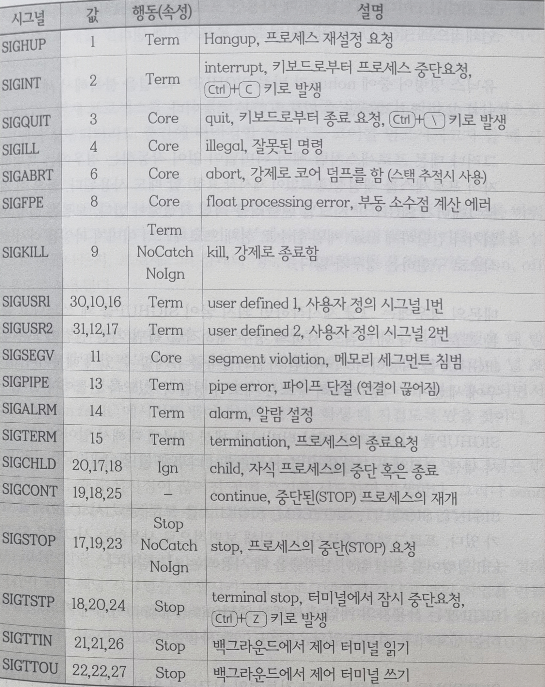
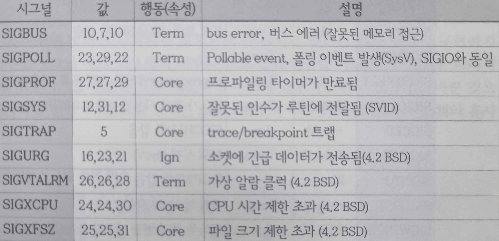

<h1> Signal</h1>

<h2> Index </h2>

- [서론](#서론)
- [시그널 행동 및 속성](#시그널-행동-및-속성)
- [표준 시그널 표](#표준-시그널-표)
- [시그널 마스크](#시그널-마스크)
	- [시그널 마스크 조작 함수](#시그널-마스크-조작-함수)
- [시그널 핸들러](#시그널-핸들러)
	- [sigaction](#sigaction)
	- [struct sigcation](#struct-sigcation)
- [sub-title](#sub-title)
	- [function\_name](#function_name)
- [**Parametters**](#parametters)
- [**Return Value**](#return-value)


## 서론
시그널 처리는 외부 신호를 받아들이는 인터페이스 조작을 의미한다.  
일반적으로 예외 처리, 외부 개입, 이벤트 통지용으로 사용된다.  
그 중 표준 시그널이라 불리는 UNIX 시그널은 예외 상황, 새입을 위해 사용된다.  


예외 처리 : 프로세스에 치명적인 오류나 자원의 제한 수치 초과  
외부 개입 : 사용자가 프로세스에 개입하여 취소나 중단을 위해 시그널을 발생시키는 것  
이벤트 통지 : 몇몇 I/O의 송수신이 완료되었을 때 시그널을 발생시키는 것  

시그널이 발생하면 실행중인 코드는 시그널에 선점되어 시그널 우선적으로 실행된다.  
시그널처리는 특정 코드를 수행하는 방법과, 시그널을 무시하는 방법이 있다.  

시그널 처리는 다양한 범주를 포함한다.  
시그널 핸들러를 작성하는 것  
시그널을 고의적으로 지연시키는 행위
시그널을 다른 프로세스에 전파하거나 송신하는 행위  
시그널에 의해 발생할 수 있는 다른 함수들의 에러처리  
  

## 시그널 행동 및 속성
| Term	| 프로세스를 종료시킨다	|
|:--|:--|
| Ign	| 아무런 작동을 하지 않는다.	|
| Core	| 프로세스를 종료시키며 코어를 덤프한다.	|
| Stop	| 포로세스를 정지시킨다.	|
| NoCatch	| 시그널 핸들러를 설치할 수 없다.	|
| NoIgn	| 시그널을 무시할 수 없다. (블록킹 불가)	|

## 표준 시그널 표
  
  
시그널은 시스템마다 다를 수 있다.  


## 시그널 마스크


### 시그널 마스크 조작 함수


## 시그널 핸들러
전달된 시그널을 받을 때 실행되는 기능을 의미한다.


### sigaction
	int stgactoin(
		int					sig,
		const struct sigcation *restrict act
	)

**Parametters**
- `int sig`	 : 대상 시그널 번호
- `sigcation *act`	: 작동과 속성이 저장된 정보 
  
**Return Value**
- `0`	: 성공
- `-1`	: 에러, errno 설정 

**Description**  
SIGKILL, SIGSTOP은 대상으로 지정할 수 없다.


### struct sigcation
```cpp
struct sigactoin{
	void 				(*sa_handler)(int);
	void 				(*sa_handler)(int, siginfo_t *, void *);
	sigset_t			sa_mask;
	int					sa_flags;
}
```
**Members**  
- `(*sa_handler)()`
  - 시그널 핸들러가 호출할 함수나 기본 행동(매크로)
  - 매크로는 SIG_DFL, SIG_IGN중 하나를 사용할 수 있다.
    - SIG_DFL	: 해당 시그널에 정해진 기본행동을 한다.
    - SIG_IGN	: 해당 시그널을 무시하여 아무것도 하지 않는다.
- `(*sa_handler)()` : 확장된 시그널 핸들러 사용시 호출할 함수
- `sa_mask` : 시그널 블록킹 마스크가 저장되는 시그널 세트
- `sa_flags;` : 시그널 핸들러의 옵션 플래그

## sub-title
### function_name
	[function]
**Parametters**
- 

**Return Value**
- 

**Description**  

 