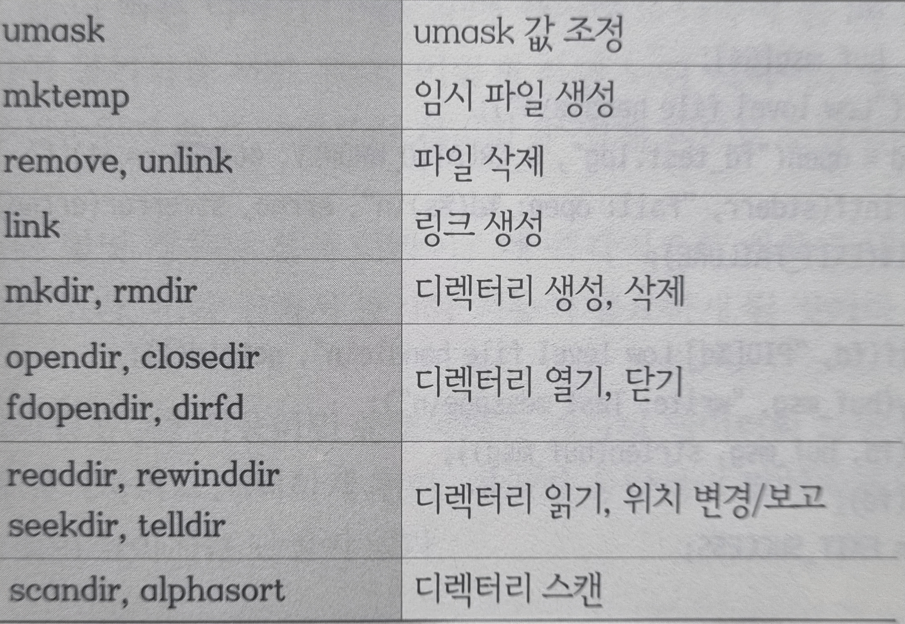

<h1> 파일 처리</h1>

<h2> Index </h2>
- 


## 서론  
파일 입출력은 크게 저수준과 고수준으로 나뉜다.  
각 방식의 차이점, 고려해야할 점 등을 서술하였다.  
파일또한 자원이기 때문에 누수가 발생한다.  
열고 닫는 행위에도 버퍼를 할당하기 때문에 오버헤드를 발생 시킬 수 있다.  
상황에 따라 적절히 닫아줘야 한다.  


## 원자적 실행  
- 원자성 (atomicity) : 더 이상 쪼개질 수 없는 성질  
- 원자적 행위(atomic action)  
더 이상 나누어질 수 없는 하나의 행위  
도중에 중단될 수 없는 하나의 동작 단위  
8장 스레드프로그래밍 - 스레드


## 저수준 파일처리  
- 파일 기술자(file descriptor) 번호를 사용하여 입출력을 진행한다.  
- 유닉스 및 호환 계열에서만 사용 가능하다.  
- 비직관적인 함수 형태  
- 보편적으로 사용됨   
- pread, pwrite를 통해 원자적 실행을 보장한다.


## 고수준 파일처리  
- 특징
FILE 구조체를 사용하여 입출을 진행한다.   
C 언어를 지원하는 모든 플랫폼에서 사용 가능  
직관적이고 사용이 편리한 함수 형태  
라이브러리 레벨의 버퍼링이 있음  
사용자 변수와 버퍼, 버퍼와 커널 간의 복사가 일어나기 때문에 메모리 대역폭을 비효율적으로 사용한다.
따라서 응답성과 성능을 중시한다면 고수준 파일처리는 최소한으로 사용해야한다.


## 함수 목록
### 저수준 함수  

  

### 고수준 함수  
  

### 그 외의 파일 관련 함수  
  


## 원자성의 보장 방법
멀티 스레드 환경에서 일반적인 입출력은 커서를 공유하여 사용하기 때문에 원자성을 보장할 수 없다.  

### 파일 입출력	
- pread, pwrite 함수를 사용한다.  
- 절대적 오프셋 주소를 사용하기 때문에 보장이 가능해진다.  
  
### 파이프 입출력
- PIPE_BUF 이내의 길이로 입출력을 진행한다.  
- 시스템에 따라 크기가 달라지며, 리눅스에서는 보통 4096byte 이다.  
- 페이지 단위에 영향을 받는 경우가 많아 4096의 배수가 사용된다.  


## 파일 출력이 섞이지 않게하는 방법  
1. 출력 함수의 원자적 실행을 보장한다.  
	- 저수준의 파일 처리를 사용해야한다.    
2. lock를 이용해 출력 과정을 보호한다.  
	- 성능을 해칠 수 있다.
  	- 간단하다.
3. 직렬화를 이용해 전문적으로 출력을 하는 프로세스나 스레드를 둔다.  
	- 설계 과정이 복잡하고 무거워진다.  
	- 신뢰성이 높고 응딥이 좋다.  
4. 메모리 맵파일(mmap)를 사용한다.
	- 5장 IPC - mmap
   

## 동기화된 I/O  
### 레이턴시    
(latency)  
자극과 반응 사이의 시간  
물리적 반응에 대한 원인과 결과 간의 지연 시간

### 수동 동기화  
동기화 시점에 fsync, fdatasync 함수를 호출한다.  

### 자동 동기화  
[open 함수](../etc.md#open)  로 파일을 열 때 옵션 플래그를 설정한다.  
| 옵션		| 설명 |
| :---: 	| :--- |
| O_SYNC	| 쓰기가 완료될 때까지 대기 |
| O_DSYNC 	| 메타 데이터를 빼고 동기화 한다. |
| O_RSYNC 	| 읽기 작업에 대해서도 동기화된 I/O를 사용한다. |

### 넌 블로킹
- 함수 호출 시 제어권을 넘겨주지 않고 실행하는 방법
- 6장 I/O 인터페이스 - 네트워킹

### 비동기적 I/O  
- 10장 리얼타임 확장  


## 저수준, 고수준 파일처리의 혼용  
문제점	: 


## posix_fadvise  
### posix_fadvise  
```
	int posix_fadvise(
		int		fd, 
		off_t		offset, 
		off_t		len, 
		int		advice)
```
**Parametters**  
- `int	fd`	: 파일 Descriptor
- `off_t offset`	: 시작 번호
- `off_t len`		: 읽을 길이	(0이면 끝까지)
- `int	advice`		: 접근할 패턴 조언  
  
| 옵션	| 설명 |
| :---: | :--- |
| POSIX_FADV_NORMAL	| 열린 파일에 아무 조언도 주지 않는다. |
| POSIX_FADV_SEQUENTIAL	| 순차적으로 접근한다. |
| POSIX_FADV_RANDOM	| 지정된 데이터에 임의 순서로 접근한다. |
| POSIX_FADV_NOREUSE	| 데이터에 한번만 접근한다. |
| POSIX_FADV_WILLNEED	| 지정한 곧 접근한다. |
| POSIX_FADV_DONTNEED	| 지정한 데이터에 접근하지 않는다. |  

POSIX_FADV_WILLNEED	: 지정 영역을 페이지 캐시로 읽어들이는 논블록 동작을 개시한다.  
POSIX_FADV_DONTNEED	: 지정 영역과 연계된 캐싱 페이지를 해제 시도한다.  

**Return Value**  
- `other`	: 에러번호
- `0`	: 성공

**Description**  
파일 데이터 접근 방식을 미리 선언한다.  
5장 IPC - mmap


## posix_spawnattr_t 함수  
### 함수명  
``` 함수 ```  

**Parametters**
- 

**Return Value**
- 

**Description**
</br>


## h2  
### h3  
**Parametters**  
- 

**Return Value**  
- 

**Description**  
</br>  
